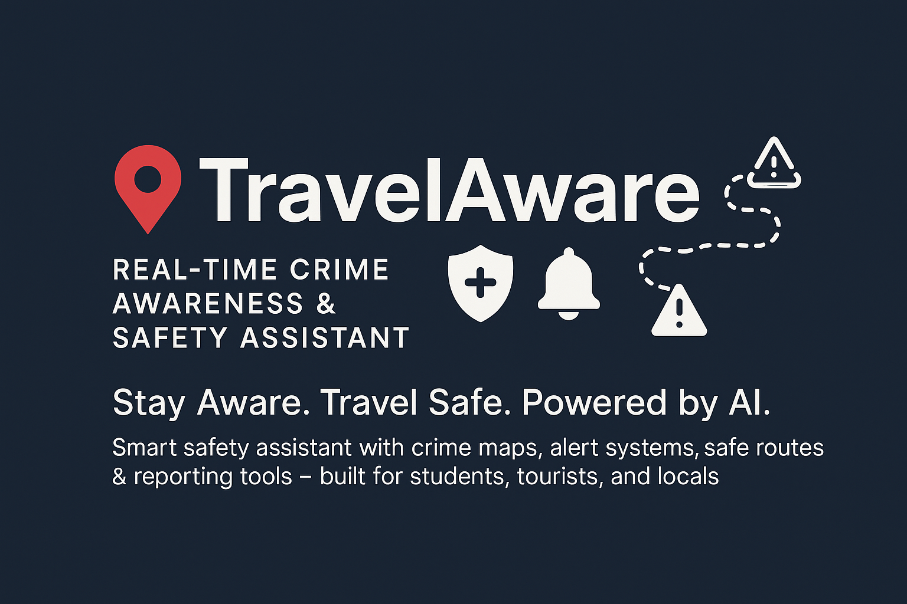
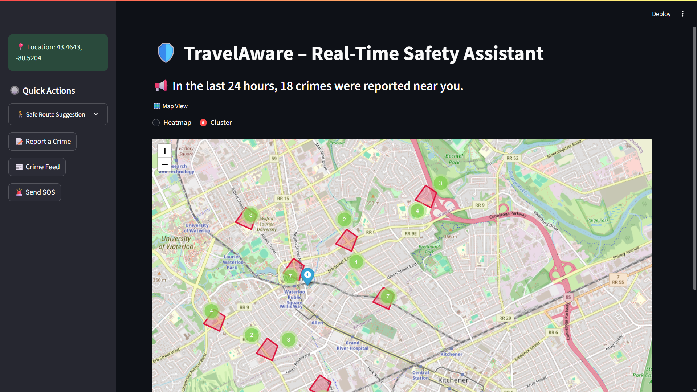
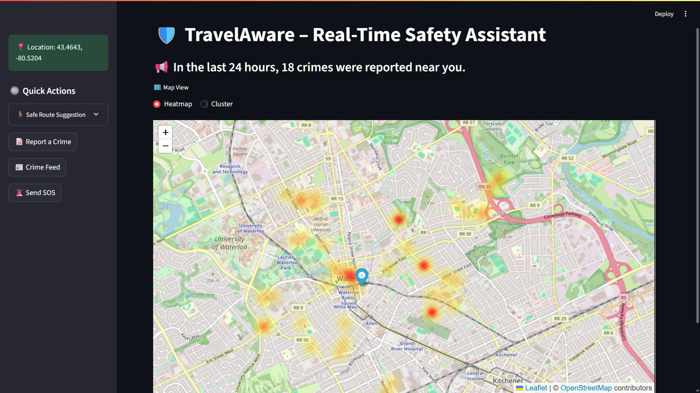
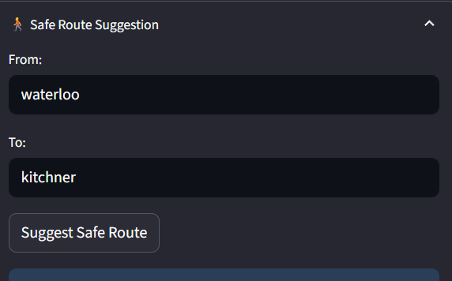
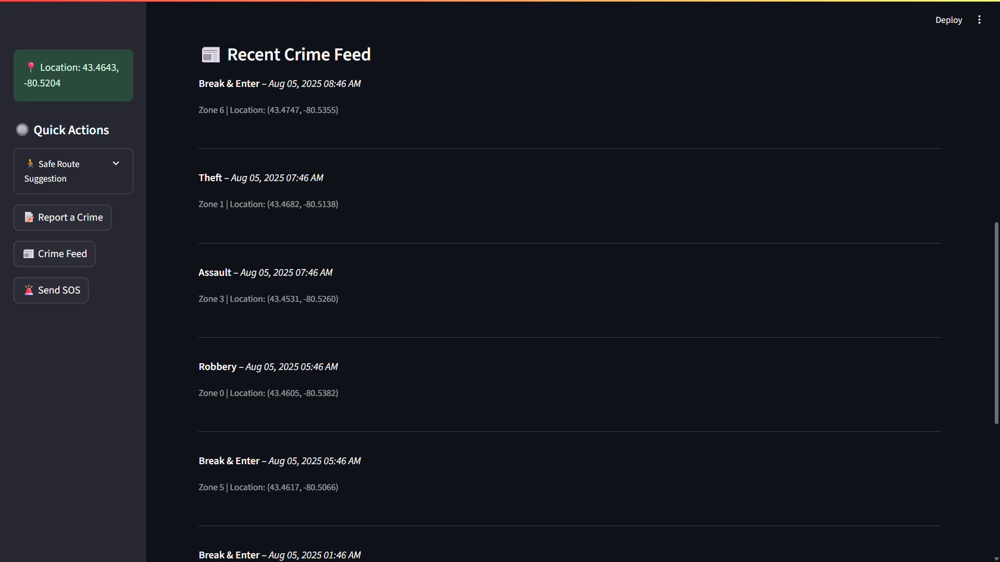

<!-- TravelAware Banner -->
<p align="center">
  
</p>

# 🛡️ TravelAware: Real-Time Crime Awareness & Safety Assistant

**TravelAware** is an AI-powered safety assistant designed for tourists, international students, and locals. It analyzes crime patterns and gives **real-time alerts**, **safe route suggestions**, and **instant SOS/reporting tools**, helping users avoid danger and make smart decisions wherever they go.

---

## 🌍 Live Demo Preview
> 🔴 Replace images below with real screenshots from your deployed app

<p align="center">  <br><i>Clusters show high-crime areas using real data</i> </p> <p align="center">  <br><i>Heatmap visualizes crime density across zones</i> </p>

---

## 🎯 Vision Board

| Section         | Description |
|----------------|-------------|
| **Vision**      | To help users stay safe by warning them about crime-prone areas in real time using actual data |
| **Target Group**| Tourists, international students, late-night workers, and safety-conscious locals |
| **Needs**       | Real-time crime alerts, area safety insights, fast SOS, safe navigation |
| **Product**     | Interactive crime maps, model-based predictions, alerts, reporting & feed |
| **Business Goals** | Partner with colleges & tourism boards, offer premium safety services, build trust via transparency |

---

## 🚀 Features at a Glance

| 🔍 Feature              | ✅ Description |
|------------------------|---------------|
| 📡 **Live Crime Map**         | Interactive map with heatmap & cluster views |
| 🧭 **Safe Route Suggestions** | Avoid high-crime areas with alternate routes |
| 🚨 **Smart Alerts**           | Banner + location-based warnings when entering danger zones |
| 📢 **Report Crime**           | Submit crime info with urgency & response prediction |
| 📰 **Crime Feed**             | Recent activity feed with time & zone context |
| 🆘 **SOS**                   | Simulated emergency contact system |

---

## 🧠 AI Models Integrated

1. 🎯 **Crime Urgency Classifier**
   - Predicts severity level: Low, Medium, High
   - Based on type of crime, patrol zone, time of report

2. ⏱️ **Response Time Regressor**
   - Predicts ETA for emergency services
   - Trained on `CallResponseTime` field with contextual info

> Both models are trained using **Random Forest** pipelines with full preprocessing (OneHot + datetime features)

---

## 🗂️ Project Structure

```
TravelAware/
├── 📘 TravelAware_README.md
├── 📓 TravelAware_Notebook.ipynb
├── 🛰️ travelaware.py              # Streamlit app
├── 📦 models/
│   ├── crime_urgency_model.pkl
│   └── response_time_model.pkl
├── 📊 Data/
│   └── WRPSAnnualDataExtract_2023.csv
├── 📄 requirements.txt
└── 📸 assets/
    ├── map_screenshot.png
    └── route_preview.png
```

---

## 🧪 Setup Instructions

```bash
# Step 1: Clone the repo
git clone https://github.com/your-username/TravelAware.git
cd TravelAware

# Step 2: Create environment
pip install -r requirements.txt

# Step 3: Run the Streamlit app
streamlit run travelaware.py
```

---

## 📥 Dataset Source

> 📂 [Waterloo Regional Police Crime Dataset (2023)](https://wrps.ca/resource/2023-wrps-annual-data-extract-csv)

---

## 📸 Screenshots Gallery

| Cluster Map | Heatmap | Route Suggestion | Crime Feed |
|-------------|---------|------------------|-------------|
 |  |  |  |

---

## 🤝 Credits

Built with ❤️ by **Krishna Reddy**  
Guided by the Agile project team, for Conestoga College

---

## 📬 Contact

Have feedback or want to collaborate?

📧 krishna.reddy@email.com  
🔗 [LinkedIn](https://linkedin.com)

---

> ⭐ Star the repo if you like the project!

<p align="center"><i>“Stay aware. Travel safe. TravelAware.”</i></p>
